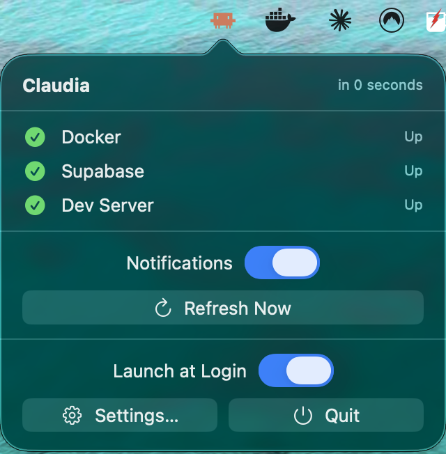
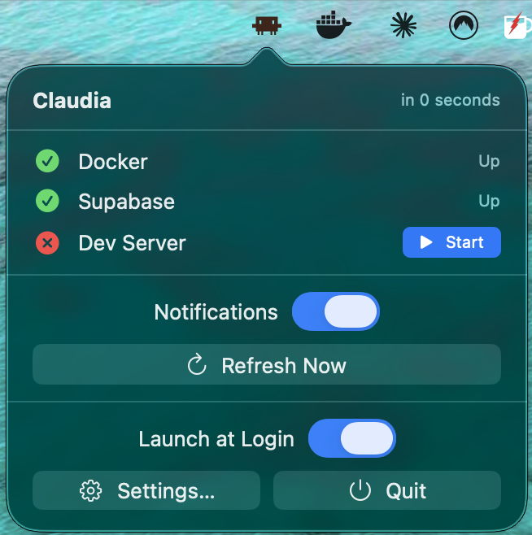
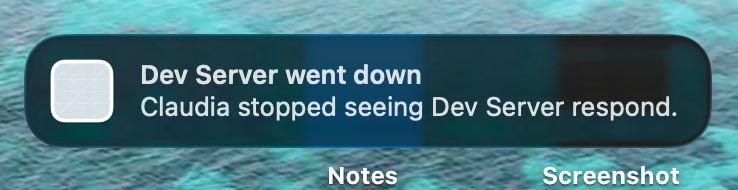
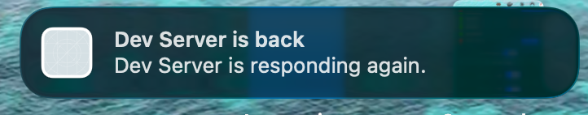
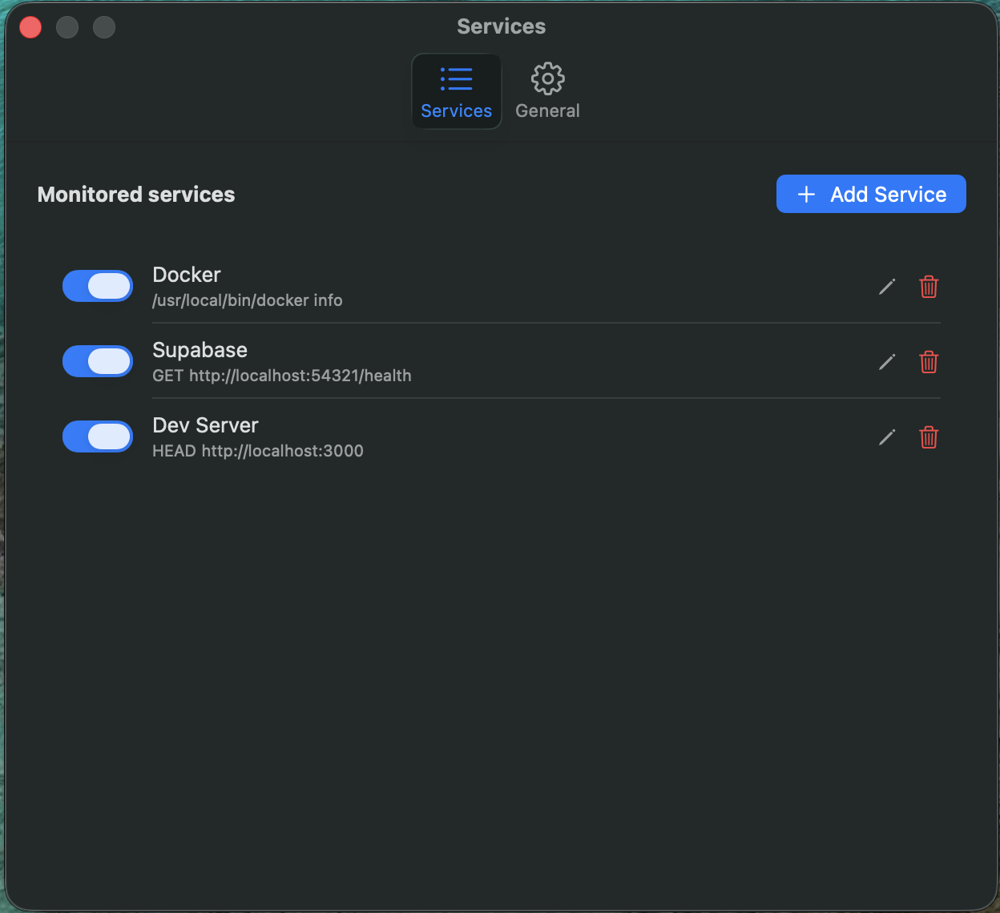
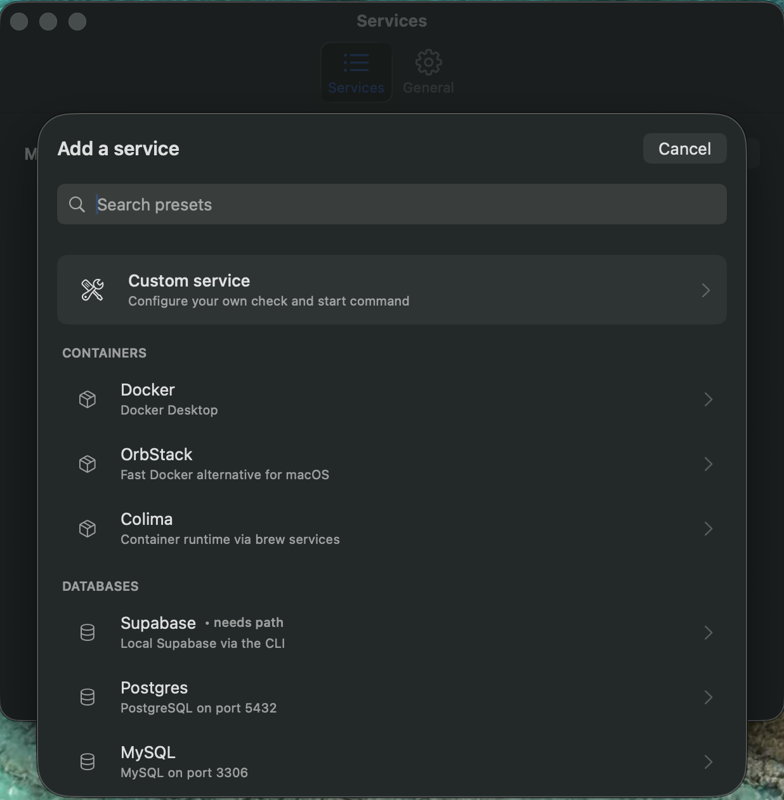
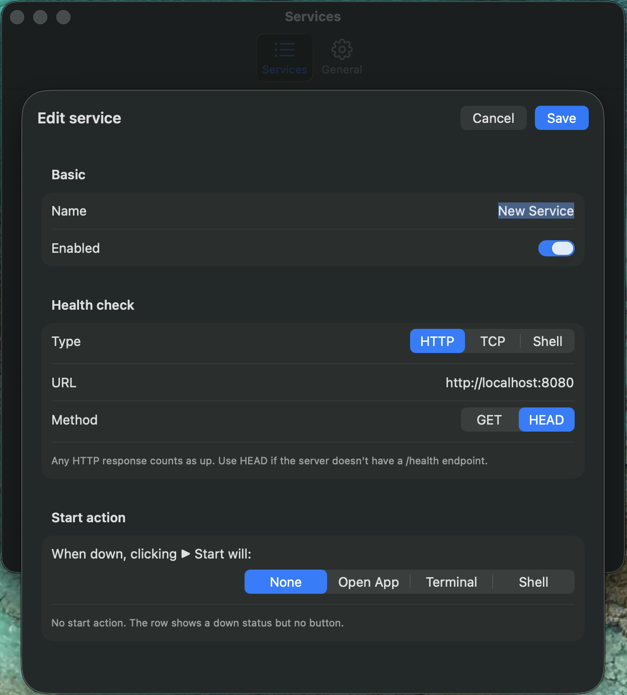
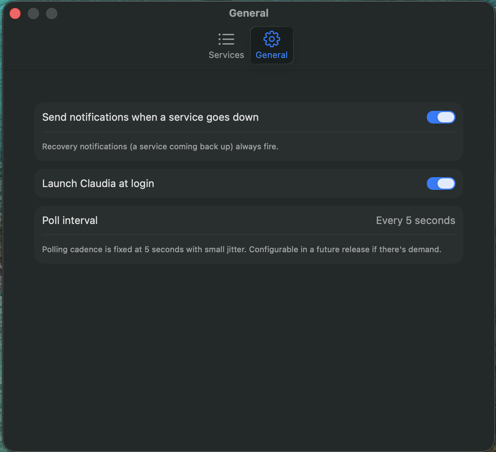

# Claudia

A macOS menu bar app that monitors your local dev services and lets you start them with one click when they're down. Pick from 17+ built-in presets (Docker, Postgres, Supabase, Redis, MySQL, MongoDB, Next.js, Vite, Astro, Storybook, Rails, Django, Mailpit, LocalStack, ngrok, OrbStack, Colima) or define your own.

  

<p align="center">
  
  &nbsp;&nbsp;
  
</p>

## What it does

Polls every 5 seconds. Shows the Claude Code icon in the menu bar:

- **Orange** — all configured services are up
- **Dark** — at least one is down
- **Grey ⚠** — status unknown (just after sleep/wake/launch)

Click the icon for the popover: per-service status, a ▶ Start button on any downed service, a Notifications toggle, Refresh Now, Launch at Login, and Settings.

When something drops (and you didn't tell it to), you get a banner. When it comes back, another banner. You can stop staring at three terminals.

<p align="center">
  
  &nbsp;
  
</p>

## Install

### Homebrew (recommended)

```bash
brew install --cask sudyke/tap/claudia-monitor
```

> Cask is named `claudia-monitor` (not `claudia`) because the unqualified `claudia` already resolves to a different cask in Homebrew's main repo.

### Direct download

Grab the latest `.dmg` from the [Releases page](https://github.com/sudyke/Claudia/releases/latest), open it, and drag **Claudia** into Applications.

**First-launch quirk:** the build is ad-hoc signed (no paid Apple Developer ID), so macOS Gatekeeper will block it the first time. Right-click `Claudia.app` in Finder → **Open** → confirm. After that, double-click works normally.

## Configure anything

Settings opens to a list of your monitored services. Toggle, edit, delete, reorder. Add new services from a preset library or build one from scratch.

<p align="center">
  
</p>

**Add Service** opens the preset picker — 17 categorized starting points, or pick **Custom service** to define your own:

<p align="center">
  
</p>

The editor exposes everything: name, check type (HTTP / TCP / Shell), start action (None / Open App / Terminal / Shell). All fields editable.

<p align="center">
  
</p>

General preferences live in the second tab: notifications toggle, launch at login, poll cadence.

<p align="center">
  
</p>

## Check types

| Type | What it does | Use for |
|---|---|---|
| **HTTP** | `GET` or `HEAD` against a URL. Any response = up. | Web servers, REST APIs, anything with an HTTP layer |
| **TCP** | Open a socket to `host:port`. Connection accepted = up. | Databases, caches, queues — Postgres, Redis, MongoDB, MySQL |
| **Shell** | Run a command. Exit 0 = up. | `docker info`, `orb status`, `colima status` |

## Start action types

| Type | What it does | Use for |
|---|---|---|
| **None** | Row shows down status with no button. | Services you only want to monitor, not control |
| **Open App** | Runs `open -a "<name>"`. | Docker Desktop, OrbStack |
| **Terminal** | Opens Terminal.app and runs `cd <folder> && <command>`. | Long-running dev servers — you see the logs |
| **Shell** | Runs a one-shot command and waits for exit. | `brew services start postgresql`, `colima start` |

## Features

- **17+ preset library** with sensible defaults; one click to add common services
- **Fully customizable** — name, check, start action all editable; build your own from scratch
- **Smart notifications** — banner alerts when a service goes down unexpectedly. Toggle off while you're intentionally stopping things. Recovery alerts always fire.
- **Sleep-aware** — pauses polling on lid-close / fast-user-switch, forces an immediate refresh on wake, suppresses false "went down" alerts during the post-wake baseline cycle
- **Launch at login** — `SMAppService`, no deprecated APIs
- **Lightweight** — Swift 6 strict concurrency, first-party Apple frameworks only, no SPM dependencies

## Build from source

Requires Xcode 16+ and macOS 14+.

```bash
git clone https://github.com/sudyke/Claudia.git
cd Claudia
./reinstall.sh        # builds Release, installs to /Applications, launches
```

To develop, open `Claudia.xcodeproj` in Xcode and Cmd+R.

To cut a new release `.dmg`:

```bash
./release.sh 0.2.1    # writes dist/Claudia-0.2.1.dmg
```

## Architecture

See [`CLAUDE.md`](CLAUDE.md) for the project rules, file layout, and critical traps (App Sandbox stays off, status icon `isTemplate = false`, no ad-hoc `Process()`, etc.).

Short version: AppKit `NSStatusItem` + `NSPopover` hosting SwiftUI via `NSHostingController`, with a `@MainActor @Observable` `StatusMonitor` driving polling through a structured `Task` loop over a user-configurable `[Service]` array. Three check strategies (HTTP / TCP socket / shell process), three start strategies (`open -a` / Terminal AppleScript / shell process), dispatched via `CheckRunner` / `ActionRunner`.

## License

MIT
